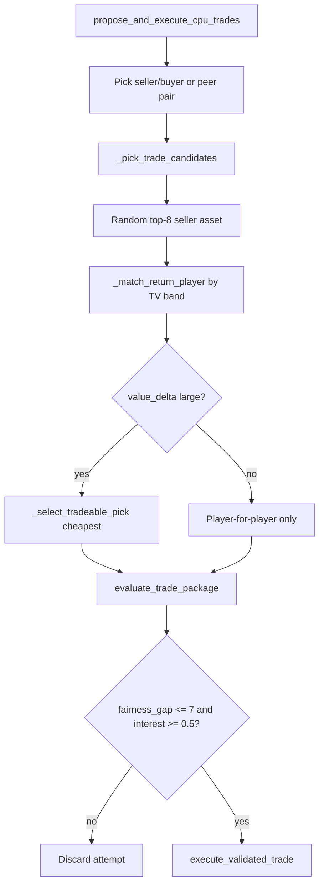

# Trade Logic Audit — How Team-to-Team Trades Actually Work

**Status:** implementation landed (2026-07-25) — ambient package motives, reverse hard-block, futures requirements, talent-gap veto, rare desperation mode  
**Date:** 2026-07-25  
**Scope:** ambient CPU ↔ CPU market, acceptance fairness, reverse trades, pick movement, desperation fleeces  
**Related:** `docs/TRADE_SYSTEM.md` (pipeline map), `docs/TRADE_AND_CONTRACT_SLOTS_AUDIT.md` (valuation / slots)

Legend: **CONFIRMED** = proven in code · **LIKELY** = strongly implied · **OPEN** = needs season telemetry or product decision

---

## Player-reported symptoms → verdict

| What you see | Root cause | Verdict |
|--------------|------------|---------|
| “Selling” teams give up younger / better players | Seller ranking + narrow prospect shield + peer swaps + TV matching | **CONFIRMED bug/design flaw** |
| Players traded back to their old club | Reverse return is soft-penalized only; no hard ban | **CONFIRMED** |
| Almost no picks, especially 1sts | Picks are optional balancers; cheapest pick chosen; 1sts heavily guarded | **CONFIRMED** |
| Clear better player swapped “even” | Accept metric is **TV / package net**, not OVR; ambient gap ≤ 7 | **CONFIRMED** |
| Almost never a desperation fleece | Ambient hard-blocks wide gaps; only cap-casualty can be asymmetric | **CONFIRMED** |

---

## 1. How a CPU trade is built (pipeline B)

**Entry:** `propose_and_execute_cpu_trades` in `cpu_trade_proposer.py`  
**Accept:** same `evaluate_trade_package` as Trade Hub, with `cpu_ambient_trade: True`

```
1. Build seller / buyer / peer pools from gm_window + cpu direction
2. Weighted-sample a pair (peer path every 5th attempt)
3. Rank movable players → _pick_trade_candidates
4. Seller offers random of top 8 candidates
5. Buyer return = closest TV match → _match_return_player (band ≈ 8.5)
6. Maybe add a pick if |value_delta| crosses thresholds → _select_tradeable_pick
7. evaluate_trade_package → reject if fairness_gap > 7 or interest < 0.50
8. execute_validated_trade
```

**Important:** the ambient market is designed as a **near-even TV swap factory**, not a hockey GM simulator with win/lose deals.

---

## 2. Why “sellers” move younger / better players — **CONFIRMED**

### 2.1 Prospect protection is too narrow

```python
def _is_prospect(player):  # age <= 21 only
```

Seller skip only when `_is_prospect` **and** OVR ≥ 78 (unless late-deadline rebuild).

So these are **not** protected as prospects:

- age 22–24 NHL-ready pieces  
- high-end 21-and-under under OVR 78  
- “better but not 88+” cores (82–87)

Soft star ban only hard-skips OVR ≥ 88 (except rare rental deadline cases).

### 2.2 Seller ranking still allows good players into the top 8

In `_pick_trade_candidates` when `seller=True`:

| Rule | Effect |
|------|--------|
| Rental + rebuild + low playoff odds | **+12** (good) |
| OVR 68–80 | **+6** (depth band preferred) |
| OVR > 84 | **−8** (soft demote, still eligible) |
| Rebuild + OVR ≥ 82 non-rental | **−4** (soft) |

Then:

```python
s_offer = s_candidates[pair_rng.randrange(0, min(len(s_candidates), 8))]
```

So a rebuild “seller” can still randomly offer an 83–87 non-rental from the top 8.

### 2.3 Peer swaps are not true sell/buy

Every 5th attempt (`CPU_PEER_ATTEMPT_MODULO = 5`) both sides come from the **peer** pool (same-window clubs). Labels still look like a trade between two “active” teams, but strategy is depth-for-depth, not seller→buyer futures.

### 2.4 TV can prefer the younger name

Matching uses `_player_trade_value` with **acquiring** perspective. A young cheap contract can score similar TV to an older higher-OVR rental. The “seller” then appears to give the better hockey player while the UI shows “fair.”

---

## 3. Reverse trades / “traded them back” — **CONFIRMED soft only**

| Control | Constant / function | Hard? |
|---------|---------------------|-------|
| Reverse reluctance in ranking | `CPU_REVERSE_TRADE_PENALTY = 0.22` → priority −4.4 | Soft |
| Reverse reluctance in match | gap += `3.5 * 0.22 * 10` ≈ **+7.7** TV gap | Soft |
| Recently acquired shop filter | `CPU_REACQUIRE_SOFT_DAYS = 35` | Soft ambient filter |
| Legality cooldown | `TRADE_ACQUISITION_COOLDOWN_DAYS = 7` | Hard — any re-trade |
| Return-to-prior-club ban | — | **Absent** |

Executor stamps `acquired_from_team_id` on move. **Nothing** in `validate_trade_rules` rejects solely because the partner is the prior club.

After ~7–35 days, a reverse depth swap that still fits the TV band can execute. That matches what you are seeing.

**Fix contract (recommended):**

1. Hard ban: cannot return a player to `acquired_from_team_id` for **N days / rest of season** (product pick).  
2. Hard ban: same unordered pair cannot reverse the **same player** within a season.  
3. Keep soft penalty as a second layer only.

---

## 4. Why picks (especially high-end) almost never move — **CONFIRMED**

### 4.1 Picks are not part of the default package

Comment in proposer: *“Add a pick only when needed to balance … — not by default.”*

Picks attach only when:

| Condition | Who sends pick | Max round |
|-----------|----------------|-----------|
| Rental sold + contender buyer + deadline > 0.4 + value_delta > 3 | Buyer → seller | 3 or 4 |
| Rebuild seller + value_delta > 5 | Buyer → seller | 3 |
| value_delta < −5 + contender buyer | Seller → buyer | 3 |

Most successful matches are already inside the TV band → **value_delta stays small** → **no pick**.

### 4.2 When a pick is chosen, it is the cheapest

`_select_tradeable_pick` sorts by pick TV **ascending** and returns the lowest. High 1sts are skipped when `protect_own_first` and projected TV ≥ 55.

### 4.3 Evaluator also clamps 1st-round sales

`_ai_interest_for_team` for rebuild windows: outgoing 1st → interest capped at **0.22**; 2nd at **0.42**. Ambient needs interest ≥ ~0.50 → rebuild 1sts almost never clear ambient accept.

**Net effect:** ambient market is structurally a **player-for-player even swap** with rare 2nd–4th round sweeteners. Futures-heavy NHL-style deals are not the ambient builder’s job today.

---

## 5. “Better player for worse, but values look equal” — **CONFIRMED**

### 5.1 Accept metric is package TV net, not OVR

```python
fairness_gap = max(team_nets) - min(team_nets)
# ambient reject if fairness_gap > CPU_AMBIENT_FAIRNESS_GAP_MAX (7.0)
```

Matching aims for `|TV_a - TV_b| ≤ max(6.5, 7+1.5) = 8.5` before evaluation.

### 5.2 Why TV compresses unequal talent

`evaluate_player_asset_value` / `_talent_base(ovr)` then applies large context mods:

- contract (cheap young vs expensive veteran)  
- acquiring need  
- team window (rebuild loves ≤23; contender loves 24–32 stars)  
- rental / UFA discount  
- age / cap-dump  

Context is clamped (±10–14). That is enough for an 84 OVR expensive UFA and a 79 OVR cheap RFA to look “even” while hockey quality is not.

### 5.3 Ambient interest is deliberately soft near zero net

```python
# net in [-8, 0): interest 0.38
# but ambient + net >= -2.75 → interest raised to 0.55
```

Near-even swaps are *encouraged* to pass. There is no “is this the clearly better hockey player?” veto.

---

## 6. Desperation fleeces almost never happen — **CONFIRMED**

### Ambient path

Hard gate:

```python
if gap > fairness_gap_max:  # 7.0
    continue
```

Deadline / cap-hell / playoff-odds-collapse only **nudge interest** (+0.08 / +0.12 style) inside `_ai_interest_for_team`. They do **not** raise the allowed fairness gap. Reason codes like `PLAYOFF_ODDS_COLLAPSE` are **labels after** a fair deal, not fleece enablers.

### Cap-casualty path (pipeline C)

`run_cpu_cap_casualty_trade_pass` sets `cap_casualty_trade: True` and **bypasses AI interest**. That is the only intentional asymmetric path — salary dumps, not general hockey fleeces.

### Missing product behavior

There is **no** ambient mode for:

- tanking seller accepting a weak return for a rental  
- contender overpaying late for a difference-maker  
- reverse: desperate buyer sending an extra 1st / prospect for a star  

Those require an explicit **asymmetric market mode** with raised gap + desperation score, gated rare.

---

## 7. Trade Hub vs ambient (same evaluator, different gates)

| | Trade Hub (user) | Ambient CPU |
|--|------------------|-------------|
| Evaluator | `evaluate_trade_package` | same |
| Context | user id set; no ambient flag | `cpu_ambient_trade: True` |
| Fairness hard gate | No (gap reported) | Yes ≤ 7 |
| Min interest | window thresholds (~0.52–0.58) | floor ~0.50 |
| Package builder | Human | TV-match factory |

So user deals *can* look fleecy if the partner’s interest still clears. CPU↔CPU ambient deals are forced near-even.

---

## 8. End-to-end flow (mental model)



---

## 9. Fix contracts (recommended, not implemented here)

Ordered by how well they match your complaints:

### A. Stop sellers from dumping young/better pieces
1. Expand prospect shield: age ≤ **23** or potential-tier / ELC, not only age ≤ 21.  
2. Seller hard-ban: non-rental OVR ≥ **82** (or TV ≥ X) unless deadline sell + rebuild + explicit “core sale” roll.  
3. Remove or heavily tax peer OVR-gap swaps (max OVR delta on peer path, e.g. ≤ 3).  
4. Prefer true rentals / UFA-year veterans when `seller` pool is active.

### B. Kill reverse bounce-backs
1. Hard ban return to `acquired_from_team_id` for rest of season (or ≥ 90 days).  
2. Season pair + same-player reverse ban.  
3. Soft penalty alone is insufficient (proven).

### C. Move real picks again
1. Rebuild sellers: **require** a pick (or prospect) in return when selling OVR ≥ 78 non-rental.  
2. Contender buyers: allow / prefer including a 2nd/3rd when acquiring rental or upgrade.  
3. Stop always choosing the cheapest pick; sample by need (futures vs win-now).  
4. Separate “futures package builder” from “depth swap builder.”

### D. Break the equal-TV illusion for clear talent gaps
1. Ambient veto if `|OVR_a - OVR_b| ≥ 5` (or TV talent component gap) unless pick/prospect sweetener closes it.  
2. Or: fairness uses **talent base only** for ambient 1-for-1; contract/need cannot fully erase a star gap.  
3. Keep full TV for multi-asset packages.

### E. Occasional desperation fleeces
1. Desperation score from: cap hell, playoff odds collapse, LTIR chaos, deadline seller, empty farm.  
2. When desperation ≥ threshold, raise ambient `fairness_gap_max` for that team only (e.g. 7 → 14–18) with low probability.  
3. Fleece must still be legal; log `trade_category: desperation_fleece` for tuning.  
4. Cap-casualty remains salary-dump path; do not overload it for hockey fleeces.

### F. Measurement gates before calling it fixed
Track over a simulated season:

- median unique partners / team  
- reverse-trade rate (target ≤ `CPU_DIVERSITY_TARGETS.max_reverse_trade_rate` = 0.12)  
- % trades including a pick; % including a 1st/2nd  
- mean \|OVR_out − OVR_in\| on 1-for-1 deals  
- % seller deals where sold OVR > return OVR by ≥ 5 with no pick  
- fleece rate when desperation score high  

---

## 10. Exact attach points (for implementers)

| Concern | Function / constant |
|---------|---------------------|
| Ambient entry | `propose_and_execute_cpu_trades` |
| Seller/buyer ranking | `_pick_trade_candidates` |
| Return match | `_match_return_player` |
| Pick attach | `_select_tradeable_pick` + value_delta gates in proposer |
| Prospect age | `_is_prospect` |
| Reverse soft | `CPU_REVERSE_TRADE_PENALTY`, `CPU_REACQUIRE_SOFT_DAYS` |
| Fairness hard gate | `CPU_AMBIENT_FAIRNESS_GAP_MAX = 7.0` |
| Interest | `_ai_interest_for_team` |
| Package accept | `evaluate_trade_package` |
| Player TV | `evaluate_player_asset_value` / `_talent_base` |
| Salary dump asymmetry | `run_cpu_cap_casualty_trade_pass` + `cap_casualty_trade` |
| User Hub bridge | `backend/services/trade_service.py` → same evaluator |

---

## 11. Bottom line

The ambient market is working as coded: **match similar trade values, keep fairness_gap ≤ 7, soft-discourage reverse, add picks only as tiny balancers.** That produces exactly the bad season feel you described — even swaps of unequal hockey talent, bounce-backs, empty pick market, and no desperate fleeces.

Cap-casualty is the only intentional “unfair” path, and it is for **cap**, not for hockey leverage.

Fixing the feel requires changing the **package builder and accept gates**, not just partner diversity or valuation math alone.
